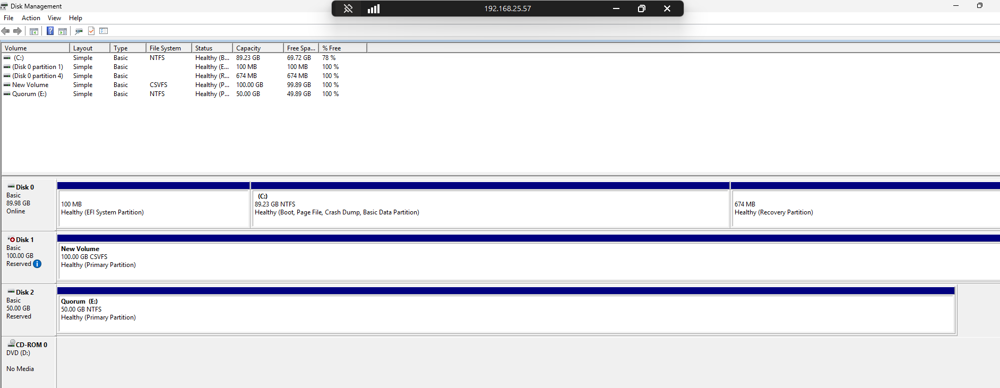
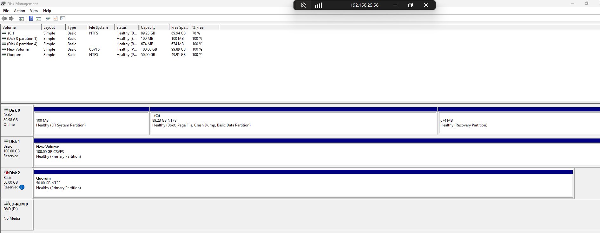

# Tài liệu mô tả quy trình cài đặt Windows Server và Hyper-V tự động hóa
---
## Chuẩn bị môi trường

- File PowerShell Script (Auto Config HostName/IP Address theo Serial Number thiết bị)
- File ISO Customize
- File Excel CSV (Gồm các cột serial_number/hostname/ethernet0_ip/gateway)

---
## Hyper-V Logical Design


---
## Hyper-V Physical Network Design

Switch Embedded Teaming-01(Ethernet1 + Ethernet4): OS MGMT Traffic & Iscsi traffic

Switch Embedded Teaming-02(Ethernet2 + Ethernet3): Hyper-V Cluster Network( Cluster/VM Workload/Live Migration)


---
## Quy trình cài đặt tự động hóa

- Quy trình cài đặt bao gồm chuẩn bị file ISO Customize và có nhúng kèm file Powershell khởi tạo các thông tin căn bản gồm HostName, IP Address dựa trên số Serial Number được định nghĩa trong file `ip_config.csv`. Xem phần cài đặt chi tiết tại `iso-customized/README.md`
- Mount file ISO Customize thông qua port quản trị IDRAC.
- Hệ thống tự động boot và cài đặt OS theo quy hoạch.
- Sau khi cài đặt thành công OS, máy chủ sẽ chạy script `init_v1.ps1` để chạy các lệnh khởi tạo các thông số sau:
  - Cấu hình Hostname theo Serial number.
  - Cài đặt dịch vụ Hyper-V và Failover Cluster.
  - Cấu hình tạo 2 vSwitch loại Switch Embedded Teaming (01 và 02)
  - Cấu hình đặt IP OS MGMT thuộc vSwitch 01

---
## Quy trình cài đặt thủ công

- Install Hyper-V with Active Directory:

```powershell
Install-WindowsFeature -Name Hyper-V -IncludeAllSubFeature -IncludeManagementTools -Restart
Install-WindowsFeature -Name Failover-Clustering -IncludeManagementTools
Set-Service -Name msiscsi -StartupType Automatic
```

- Create VMSwitch:

```powershell
Get-NetAdapter
New-VMSwitch -Name "vSwitch01" -NetAdapterName "Ethernet1","Ethernet4"
New-VMSwitch -Name "vSwitch02" -NetAdapterName "Ethernet2","Ethernet3"
```

- Change LB mode to Dynamic & Verify :

```powershell
Set-VMSwitchTeam -Name "vSwitch01" -LoadBalancingAlgorithm Dynamic
Set-VMSwitchTeam -Name "vSwitch02" -LoadBalancingAlgorithm Dynamic
Get-VMSwitchTeam -Name "vSwitch01" | FL
Get-VMSwitchTeam -Name "vSwitch02" | FL
```

- Create Failover Cluster:

```powershell
Test-Cluster -Node node01.cluster01.vn, node02.cluster01.vn
New-Cluster -Name HMCluster -node node01.cluster01.vn, node02.cluster01.vn -staticAddress 192.168.25.55
```

- Config Quorum Disk:

Format NTFS and Assign Letter for both node


Add Quorum Disk to Cluster


Reference:

https://learn.microsoft.com/en-us/windows-server/failover-clustering/create-workgroup-cluster?tabs=desktop

https://learn.microsoft.com/en-us/windows-server/failover-clustering/clustering-requirements#storage

https://learn.microsoft.com/en-us/windows-server/failover-clustering/deploy-quorum-witness?tabs=domain-joined-witness%2Cfailovercluster%2Cfailovercluster1&pivots=disk-witness

---
## Troubleshoot 

#### MaxEnvelopSizeKB

```powershell
Set-Item -Path WSMan:\localhost\MaxEnvelopeSizekb -Value 1024
Enable-NetFirewallRule -DisplayGroup "Remote Service Management"
Enable-NetFirewallRule -DisplayGroup "Windows Remote Management"
Enable-NetFirewallRule -DisplayGroup "File and Printer Sharing"
Restart-Service WinRM
```