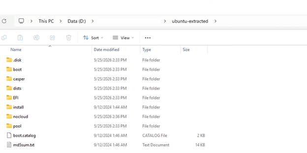
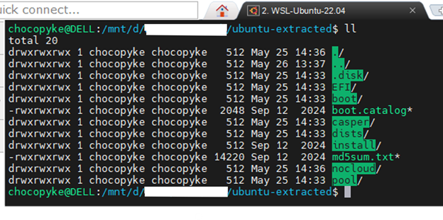
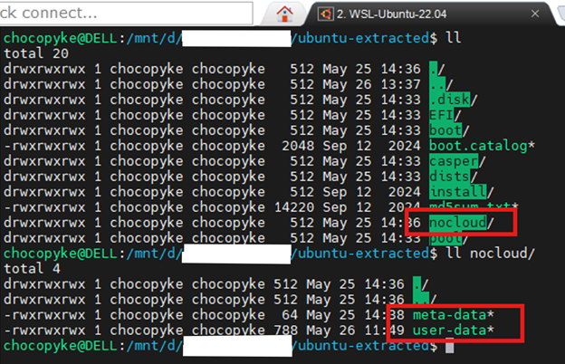
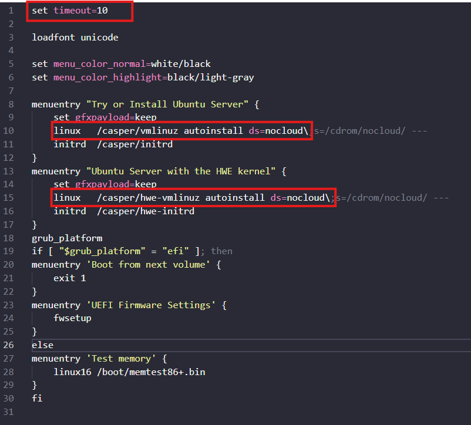
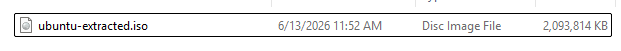
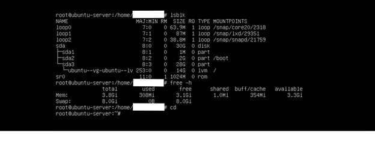

#### Requirements
- Original Ubuntu ISO
- Tools: xorriso
- Environments: WSL or Linux, Debian, ... (Ubuntu environment is recommended)

#### Step 1: Extract the original Ubuntu ISO
Mount or extract the original ISO to the OS and copy it to another folder. This folder will be used for the "Creating new ISO" process



#### Step 2: Create Autoinstall configuration
Move to directory "nocloud/" in the extracted ISO folder, then create "meta-data" and "user-data" file.


With "user-data" file, this is our predefined configuration for the Operating System, showing how they should be configure and setup. For more details, please reference to the following [document](https://canonical-subiquity.readthedocs-hosted.com/en/latest/reference/autoinstall-reference.html).

For example, a basic user-data file will look like this:
```
#cloud-config
autoinstall:
  version: 1

  locale: en_US.UTF-8
  keyboard:
    layout: us
  timezone: Asia/Ho_Chi_Minh

  identity:
    hostname: <Enter your computer hostname>
    username: <Enter your computer username>
    password: <Use the “openssl passwd -6” command to generate password for this field>

  ssh:
    install-server: true
    allow-pw: true
    authorized-keys: []

  storage:
    layout:
      name: lvm
    swap:
      size: 8G

  shutdown: reboot
  late-commands:
    - curtin in-target --target=/target -- bash -c "echo 'root:<Nhập pass mới>' | chpasswd"
    - curtin in-target --target=/target -- sed -i 's/^#\?PermitRootLogin.*/PermitRootLogin yes/' /etc/ssh/sshd_config
    - curtin in-target --target=/target -- systemctl restart ssh
```
**Note:** Output of the ISO using this configuration will be shown in step 5.

With meta-data file, Ubuntu default configuration require this file to be exist first, so it can read the content in user-data file. So, we just need to keep this file exist, don't need to do anything else.

#### Step 3: Adjust Boot Menu (GRUB)
Default when booted, an ISO file will wait until we press "Next". We need to adjust this configuration in the grub.cfg file to point back to our user-data file.
Following these step to adjust the /boot/grub/grub.cfg file:
- **set timeout** is a parameter for the menuentry waiting time. If you don't want the menuentry to appear and want to boot directly to the next settings section, set this value to 0. Otherwise, you can set any value you want.
- **menuentry** will be the option that display on screen when we first booted to the ISO file
- The **linux** line plays a role in loading the kernel into RAM and passing parameters to guide how the system boots.
  - /casper/vmlinuz: the directory path containing the system files of the Ubuntu Live CD environment.
  - autoinstall: enables automatic installation mode.
  - ds=nocloud;s=/cdrom/nocloud/: tells Cloud-init the location of the configuration file. When the ISO file boots, the entire contents are mounted to the /cdrom directory. This parameter must point to the directory where the user-data and meta-data files are stored.
- After completing the configuration steps, we have a grub.cfg file similar to the one below:


#### Step 4: Repack into new ISO file
It is recommended to use **xorriso** command on your Ubuntu/WSL to repack our setup into new ISO file. Following this instruction:
```
xorriso -as mkisofs -r -V "<ISO_VOLUME_NAME>" -J -joliet-long -l \
  -o <OUTPUT_ISO_PATH> \
  -c <BOOT_CATALOG_FILE> \
  -b <BOOT_FILE_FOR_BIOS_LEGACY> \
  -no-emul-boot -boot-load-size 4 -boot-info-table \
  -eltorito-alt-boot \
  -e <BOOT_FILE_FOR_UEFI> \
  -no-emul-boot \
  <EXTRACTED_ISO_PATH>
```
For example:
```
xorriso -as mkisofs   -r -V "UBUNTU_CUSTOM"   -J -joliet-long -l \ 
 -o /mnt/d/…/ubuntu-custom.iso \
 -c boot.catalog \
 -b boot/grub/i386-pc/eltorito.img \
 -no-emul-boot -boot-load-size 4 -boot-info-table \ 
 -eltorito-alt-boot \
 -e EFI/boot/bootx64.efi \
 -no-emul-boot \
 ubuntu-extracted
```

After this step, we have a new ISO file as image below:



#### Step 5: Create VM from new ISO file and check their configuration

