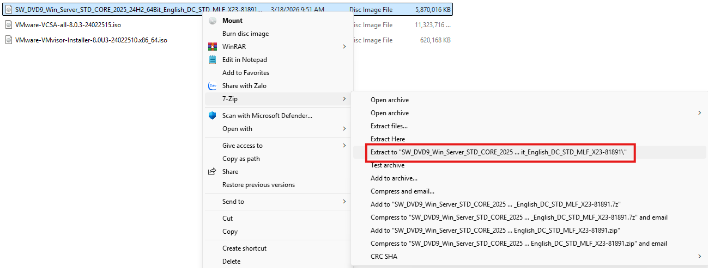
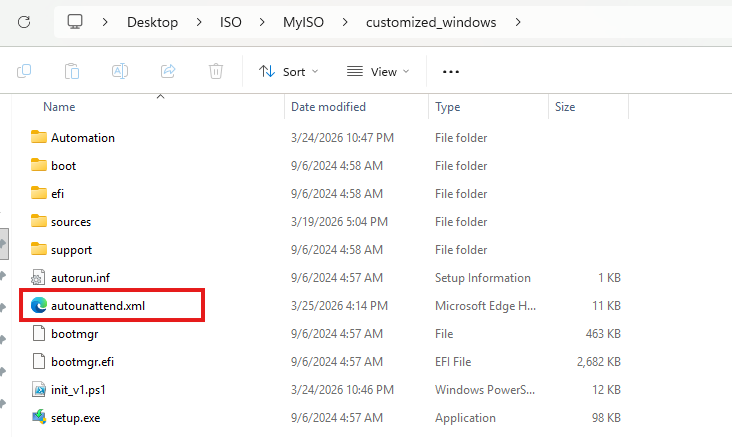
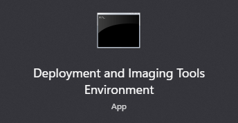

### Requirement:
- Has **WindowsPE** and **WindowsADK** installed on your device.

## How to?
#### 1. Extract ISO file to a folder

#### 2. Copy autounattend.xml file to the ISO root folder

#### 3. Build ISO file again
- Open Deployment and Imaging Tools as Administrator:


- Run this script to build new ISO file:
```
oscdimg -m -o -u2 -udfver102 -bootdata:2#p0,e,b<EXTRACTED-ISO-PATH>\boot\etfsboot.com#pEF,e,b<EXTRACTED-ISO-PATH>\efi\microsoft\boot\efisys.bin <EXTRACTED-ISO-PATH> <NEW-ISO-PATH>\<NEW-ISO-NAME>.iso
```

#### For more information, read the following document:
```
https://www.starwindsoftware.com/blog/windows-server-2025-unattend-xml-answer-file-creation/
```